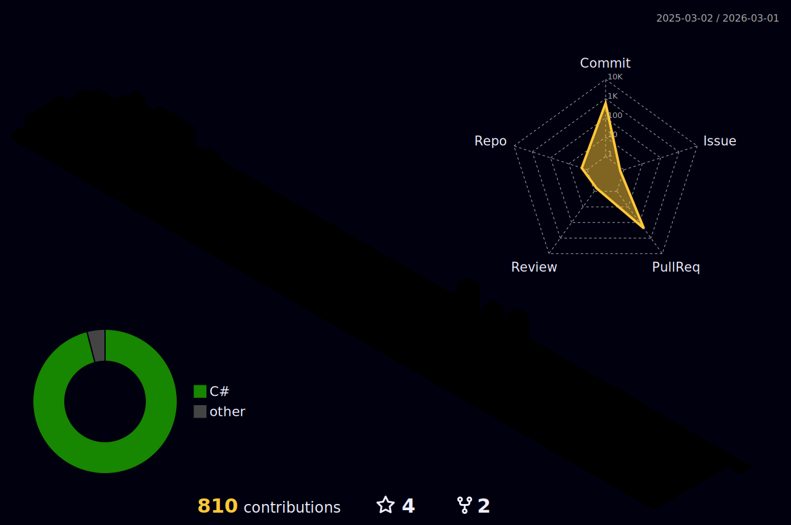

# 💫 About Me:
Hi 👋, I'm Nguyễn Hồ Tân Tiến  A passionate and dedicated Back-End C# Developer from Vietnam, specializing in building scalable, high-performance server-side solutions, crafting secure APIs, and optimizing business logic using C# and .NET technologies. With a deep understanding of database architecture and a focus on efficient, maintainable code, I thrive in creating seamless, robust applications that power complex systems.  🌱 I’m currently learning: ASP.NET Core, Entity Framework  💬 Ask me about: C#  📫 How to reach me: nguyenhotantien@gmail.com  ⚡ Fun fact: Want that, do that, earn that.

## 🌐 Socials:
     

# 💻 Tech Stack:
                          

# 📊 GitHub Stats:
 
 

## 🏆 GitHub Trophies

### 🔝 Top Contributed Repo

---

<!-- Proudly created with GPRM ( https://gprm.itsvg.in ) -->

